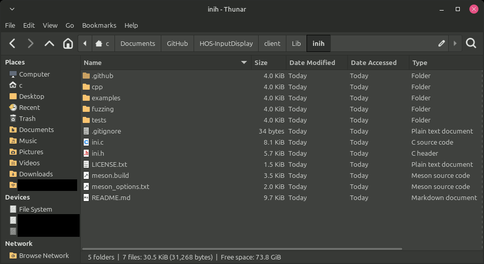
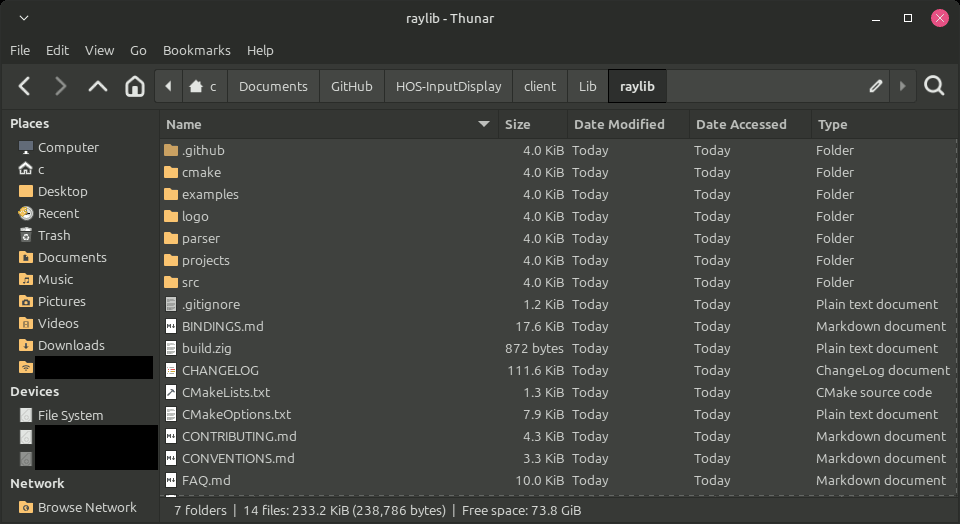

# HOS-InputDisplay

Nintendo switch input display meant as a replacement for OJDS-NX, because OJDS-NX causes load times to increase in some games. This can still be the case with this input display, but it is minimal.

## Build (Sysmodule)
Use devkitPro and make to build

## Build (Display)

### statically-linked libraries

note: these instructions are specific to this branch/fork. i'm probably doing this wrong, but using git submodules like the base project made me run into weird issues i couldn't solve and had to work around. (this is my workaround.)

- Download [inih (version r57)](https://github.com/benhoyt/inih/releases/tag/r57) and [raylib v4.5.0](https://github.com/raysan5/raylib/releases/tag/4.5.0). For each, download by clicking the blue-text hyperlink that reads "Source code (zip)".
- Move the downloaded .zip files into the project's `client/Lib/` folder, then unzip them.
- For the resulting unzipped folders, rename them "inih" and "raylib" respectively.
- The folders should look something like the following screenshots:

|  |  |
| ------------- | ------------- |

### cmake build
Build with CMake, use MSys2 on Windows
1. in client/ run `cmake -S ./ -B ./Build/`
2. in client/Build/ run `make`

the resulting files will be in the client/Build/ folder. the executable is named HOS-InputDisplay, and the config.ini file is in the client/Build/Res/ folder.

## Installation
Place the .nsp in /atmosphere/contents/0100000000000901/exefs.nsp, the toolbox.json in /atmosphere/contents/0100000000000901/toolbox.json, and create /atmosphere/0100000000000901/flags/boot2.flag

# Usage
Put your switch IP in config.ini, and run the display program (make sure the sysmodule is running on your switch).
Press L + ZL + ZR + R + Plus to restart the input server.
